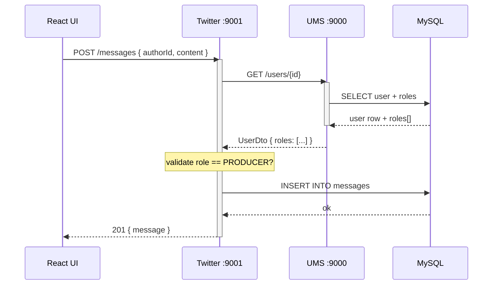

# Local Twitter application — Twitter Clone

A microservice-based Twitter/X clone built for **CST8277 Enterprise Application Programming** at Algonquin College in Ottawa, ON.

The goal is to demonstrate microservice architecture in practice — its benefits, trade-offs, and implementation patterns — while guiding students through building the same system step by step.

## Documentation

| Document | Description |
|---|---|
| **[UMS Service →](./ums/README.md)** | User Management Service — users, roles, sessions |
| **[Twitter Service →](./twitter/README.md)** | Messaging & Subscriptions Service |
| **[Frontend (UI) →](./frontend/README.md)** | React + Vite web interface |

## Project Goals

This project walks students through four phases of enterprise software development:

1. **General Design** — Architecture decisions, service boundaries, API contracts
2. **Data Model** — Schema design with production-quality practices (UUIDs, constraints, indexes)
3. **Implementation** — Reactive Spring Boot microservices with JDBC
4. **Securing Applications** *(upcoming)* — Auth, sessions, role-based access control

## Architecture Overview



## Request Flow — Posting a Message



## Tech Stack

| Layer | Technology | Version |
|---|---|---|
| **Backend runtime** | Java | 25 |
| **Backend framework** | Spring Boot (WebFlux) | 4.0.5 |
| **Build tool** | Gradle | 9.4.1 |
| **Database** | MySQL | 8 (latest Docker image) |
| **JDBC driver** | mysql-connector-j | managed by Spring BOM |
| **JSON** | Jackson + JavaTimeModule | managed by Spring BOM |
| **Code generation** | Lombok | managed by Spring BOM |
| **Frontend framework** | React | 18 |
| **Frontend build** | Vite | 5 |
| **HTTP client (FE)** | Axios | 1.7 |
| **State management** | Zustand | 4.5 |
| **Routing** | React Router | 6 |
| **Date utilities** | date-fns | 3.6 |
| **Container** | Docker | any recent |
| **API spec** | OpenAPI 3.0 (YAML) | — |

## Installation

### Quick Start (TL;DR)

```bash
# 1. Clone
git clone https://github.com/eugenezimin/bird.git && cd bird

# 2. Start MySQL
docker run -e MYSQL_ROOT_PASSWORD=passw -d --name bird \
  -v bird-db-data:/var/lib/mysql \
  -v ./database/mysql:/database -p 3306:3306 mysql:latest

# 3. Seed database
cd database/mysql
docker exec -i bird mysql -u root -ppassw < 01_ums_ddl.sql
docker exec -i bird mysql -u root -ppassw < 02_twitter_ddl.sql
docker exec -i bird mysql -u root -ppassw < 03_ums_dml.sql
docker exec -i bird mysql -u root -ppassw < 04_twitter_dml.sql
cd ../..

# 4. Start UMS  (terminal 1)
cd ums && gradle build && java -jar build/libs/ums-2.0.jar

# 5. Start Twitter  (terminal 2)
cd twitter && gradle build && java -jar build/libs/twitter-2.0.jar

# 6. Start Frontend  (terminal 3)
cd frontend && npm install && npm run dev
```

Full step-by-step instructions are in the sections below.

### Step-by-Step Setup

#### Prerequisites

Make sure all of these are installed before starting:

| Tool | Required version | Check |
|---|---|---|
| JDK (Oracle) | 25 | `java -version` |
| Gradle | 9.4.1 | `gradle -version` |
| Docker | any recent | `docker -v` |
| Node.js | 20+ | `node -v` |
| npm | 10+ | `npm -v` |

> **`JAVA_HOME`** must point to JDK 25. Both services use Java preview features and will not start on older JDKs.

#### Step 1 — Clone the repository

```bash
cd $HOME
git clone https://github.com/eugenezimin/bird.git
cd bird
```

#### Step 2 — Start MySQL in Docker

```bash
docker run \
  -e MYSQL_ROOT_PASSWORD=passw \
  -d --name bird \
  -v bird-db-data:/var/lib/mysql \
  -v ./database/mysql:/database \
  -p 3306:3306 \
  mysql:latest
```

Wait ~10 seconds for MySQL to finish initialising, then verify it is running:

```bash
docker ps | grep bird
```

#### Step 3 — Create schemas and seed data

Run all four SQL files **in order** from the `database/mysql/` directory:

```bash
cd $HOME/bird/database/mysql

docker exec -i bird mysql -u root -ppassw < 01_ums_ddl.sql
docker exec -i bird mysql -u root -ppassw < 02_twitter_ddl.sql
docker exec -i bird mysql -u root -ppassw < 03_ums_dml.sql
docker exec -i bird mysql -u root -ppassw < 04_twitter_dml.sql
```

| File | Purpose |
|---|---|
| `01_ums_ddl.sql` | Creates `ums` database + tables (users, roles, users_roles, sessions) |
| `02_twitter_ddl.sql` | Creates `twitter` database + tables (messages, subscriptions) |
| `03_ums_dml.sql` | Seeds 12 users, 3 roles, role assignments |
| `04_twitter_dml.sql` | Seeds 25 messages + 26 subscriptions |

To verify:

```bash
docker exec -it bird mysql -u root -ppassw -e "SELECT COUNT(*) FROM ums.users;"
docker exec -it bird mysql -u root -ppassw -e "SELECT COUNT(*) FROM twitter.messages;"
```

#### Step 4 — Build and run UMS Service

Open a **new terminal** for this service.

```bash
cd $HOME/bird/ums
gradle build
java -jar build/libs/ums-2.0.jar
```

UMS starts on **http://localhost:9000**

Quick smoke test:

```bash
curl http://localhost:9000/users
```

You should receive a JSON envelope with 12 users.

#### Step 5 — Build and run Twitter Service

Open another **new terminal** for this service. UMS must already be running.

```bash
cd $HOME/bird/twitter
gradle build
java -jar build/libs/twitter-2.0.jar
```

Twitter service starts on **http://localhost:9001**

Quick smoke test:

```bash
curl http://localhost:9001/messages
```

#### Step 6 — Start the Frontend

Open a third **new terminal**.

```bash
cd $HOME/bird/frontend
npm install
npm run dev
```

The React app is now at **http://localhost:5173**

## Verification

After all three steps, you should have:

| Service | URL | Status |
|---|---|---|
| UMS | http://localhost:9000 | `GET /users` → 200 |
| Twitter | http://localhost:9001 | `GET /messages` → 200 |
| Frontend | http://localhost:5173 | React app loads |
| MySQL | localhost:3306 | Port open |

Import the OpenAPI spec from `requests/OpenAPI/requests.yaml` into **[Postman](https://www.postman.com/downloads/)**, **[Bruno](https://www.usebruno.com)**, or **[Hopscotch](https://docs.hoppscotch.io/documentation/clients/desktop/overview)** to explore all available endpoints interactively.

## Repository Structure

```
bird/
├── README.md                  ← You are here
├── docs/
│   ├── UMS.md                 ← UMS service deep-dive
│   ├── TWITTER.md             ← Twitter service deep-dive
│   └── UI.md                  ← Frontend deep-dive
│
├── database/
│   └── mysql/
│       ├── 01_ums_ddl.sql     ← UMS schema
│       ├── 02_twitter_ddl.sql ← Twitter schema
│       ├── 03_ums_dml.sql     ← UMS seed data (12 users)
│       └── 04_twitter_dml.sql ← Twitter seed data (25 msgs, 26 subs)
│
├── ums/                       ← UMS Spring Boot service
│   ├── build.gradle
│   ├── settings.gradle
│   └── src/main/java/com/ziminpro/ums/
│       ├── controllers/       ← REST controllers
│       ├── services/          ← Business logic
│       ├── dao/               ← JDBC repositories
│       └── dtos/              ← DTOs, constants, SQL strings
│
├── twitter/                   ← Twitter Spring Boot service
│   ├── build.gradle
│   ├── settings.gradle
│   └── src/main/java/com/ziminpro/twitter/
│       ├── controllers/       ← REST controllers
│       ├── services/          ← Business logic
│       ├── dao/               ← JDBC repositories
│       └── dtos/              ← DTOs, constants, SQL
│
├── frontend/                  ← React + Vite UI
│   ├── package.json
│   ├── vite.config.js
│   └── src/
│       ├── api/               ← Axios clients (umsApi, twitterApi)
│       ├── components/        ← Reusable UI components
│       ├── pages/             ← Route-level views
│       ├── store/             ← Zustand global state
│       ├── hooks/             ← Custom React hooks
│       └── utils/             ← Helpers (date formatting, envelope extraction)
│
└── requests/
    └── OpenAPI/
        └── requests.yaml      ← Full OpenAPI 3.0 spec
```

## Key Design Decisions

**Binary UUIDs** — Primary keys use `BINARY(16)` with `UUID_TO_BIN()` / `BIN_TO_UUID()` instead of `CHAR(36)`. This halves index size and significantly improves query performance on large tables.

**Cross-database referential integrity** — MySQL does not support foreign keys across databases. The `twitter` service references users by UUID but enforces integrity at the application layer via `UMSConnector`, which calls UMS before every write.

**Reactive stack** — Both services use Spring WebFlux (Netty). The Twitter service calls UMS asynchronously via `WebClient`, returning `Mono<ResponseEntity>` chains rather than blocking.

**Sessions table** — Instead of a simple `last_visit` timestamp on the user, a dedicated `sessions` table tracks full login/logout history. This enables audit trails and concurrent session detection.

**DATETIME over epoch integers** — All timestamps are stored as `DATETIME` in MySQL and deserialized as `LocalDateTime` in Java (via `JavaTimeModule`). This avoids timezone math bugs and makes SQL queries human-readable.

## Seed Data

The database ships with realistic fictional data:

- **12 users** — world leaders as personas (Donald Trump, Emmanuel Macron, Xi Jinping, etc.)
- **3 roles** — `ADMIN`, `PRODUCER`, `SUBSCRIBER`
- **25 messages** — spread across 8 producer accounts, max 280 characters each
- **26 subscriptions** — forming a realistic social graph

## Contributing

1. Fork the repository
2. Create a branch: `git checkout -b my-feature`
3. Make your changes with clear commit messages
4. Push and open a Pull Request describing what you changed and why

Please ensure code is well-commented and consistent with the existing style.

## License

[BSD 2-Clause License](LICENSE) - Use it like you want :)