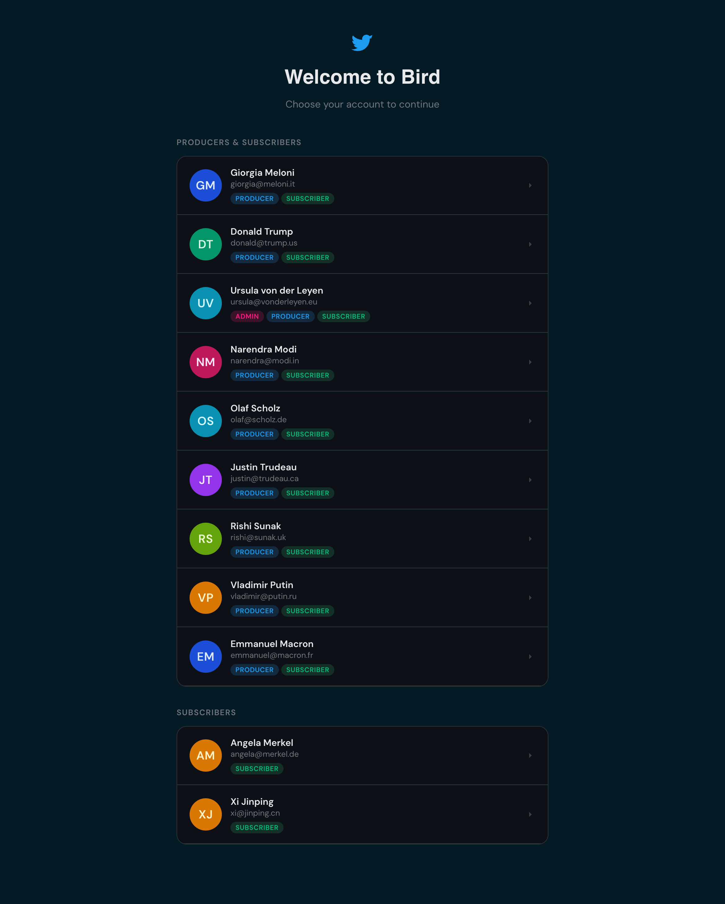
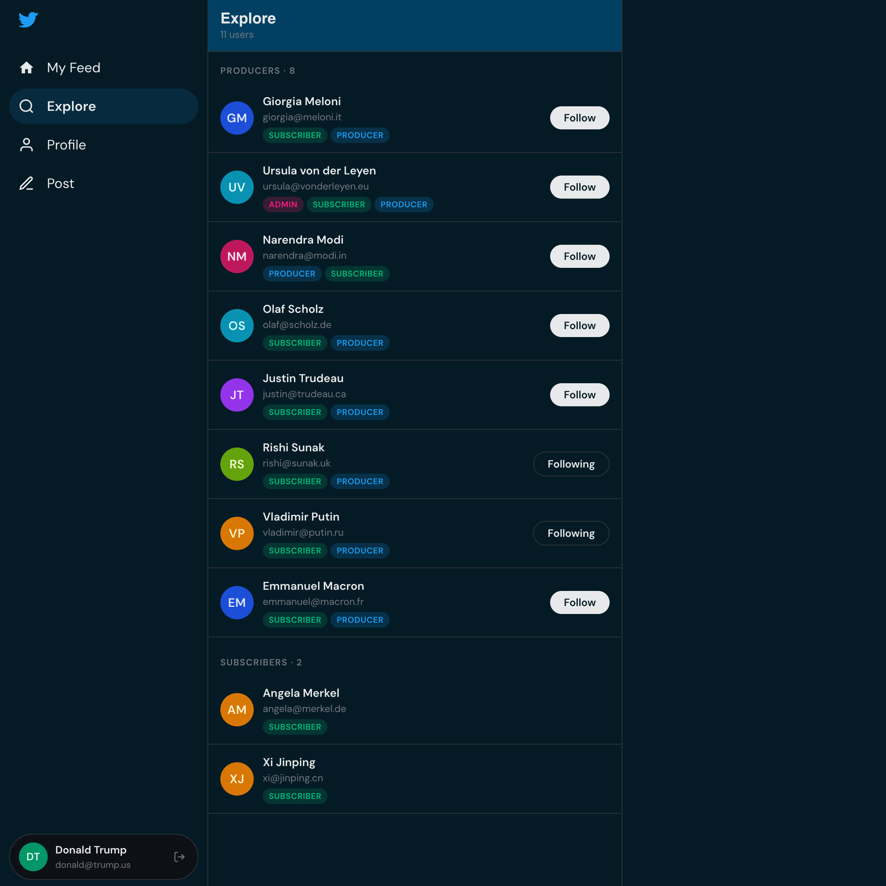
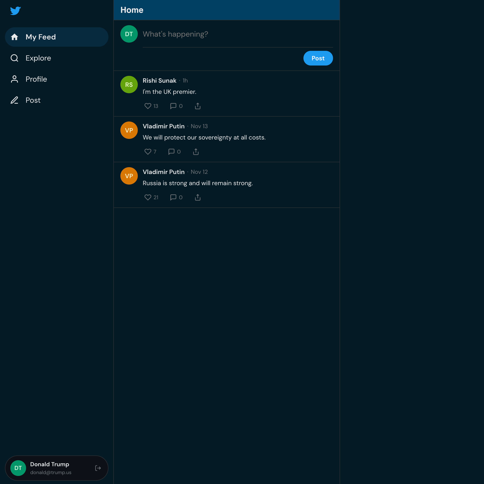
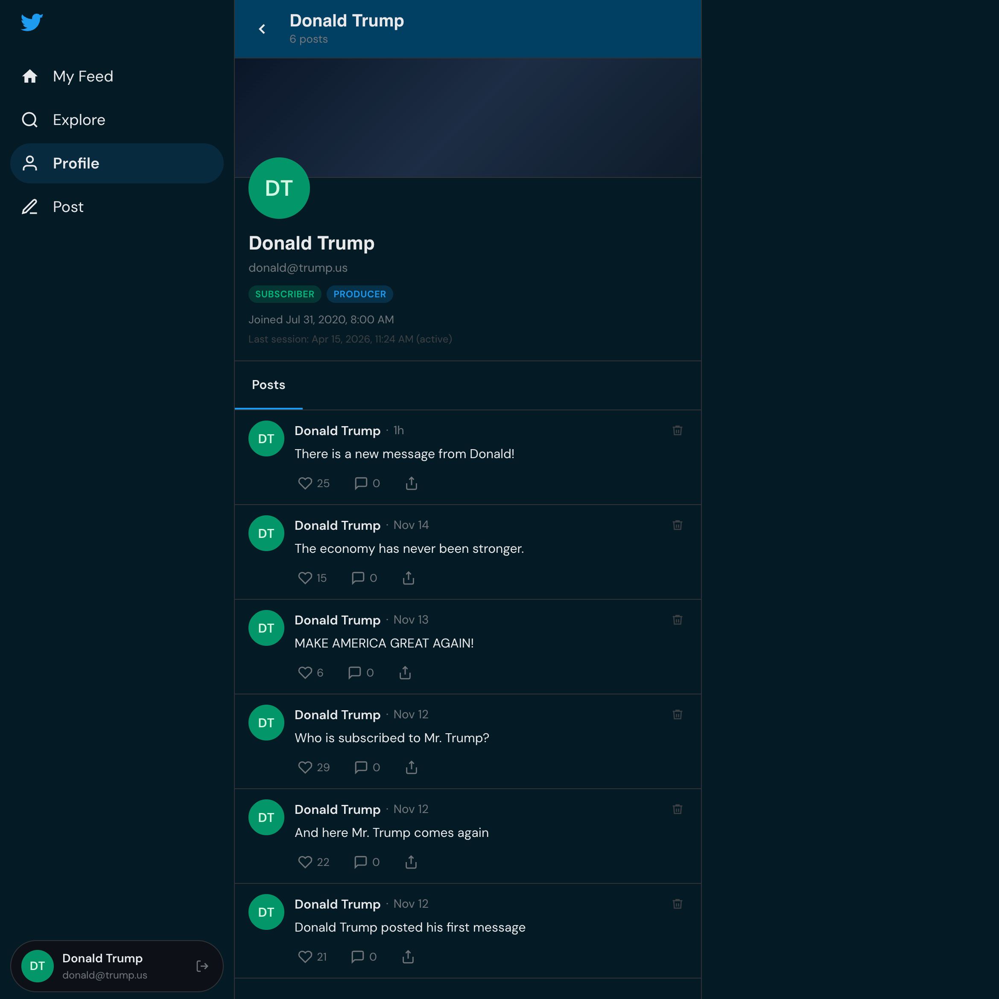
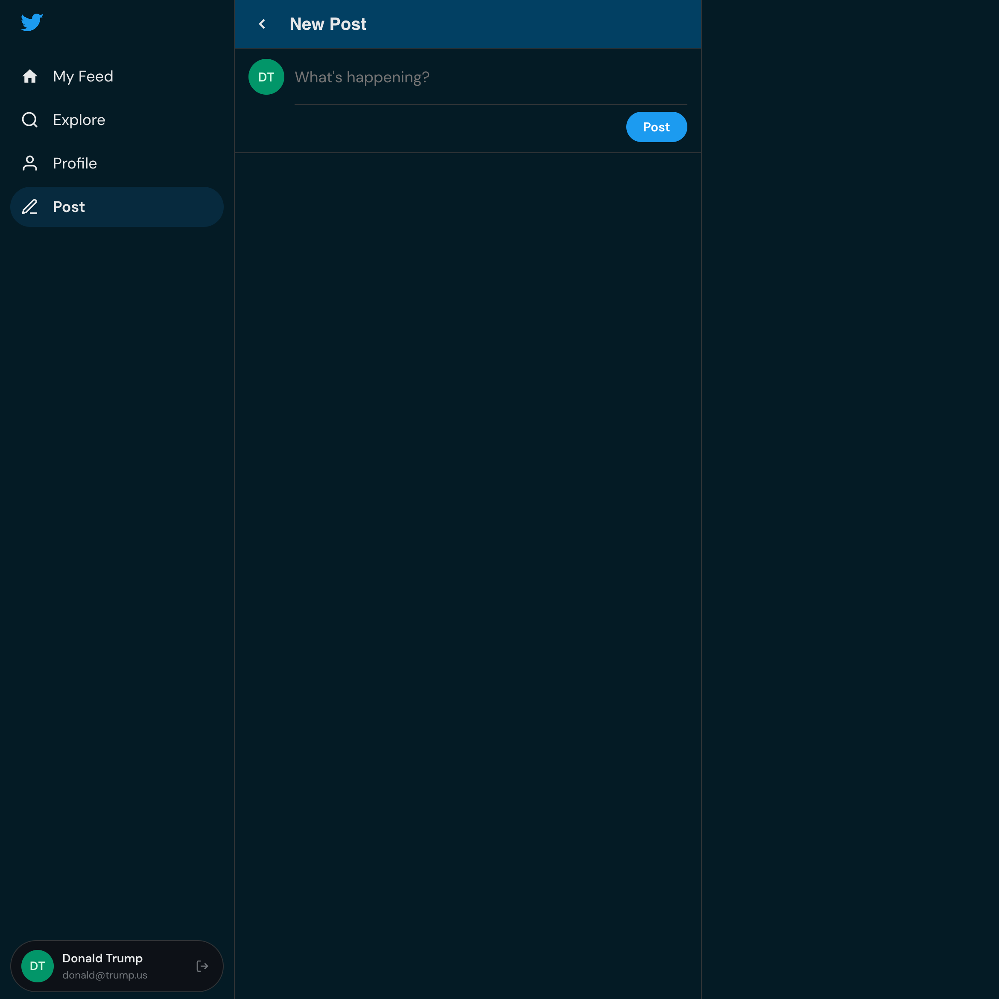

# 🖥️ Frontend — React + Vite UI

[← Back to root README](../README.md)

The Bird frontend is a single-page React application that provides a Twitter-like UI over the two backend microservices. It is intentionally structured as a real-world application rather than a tutorial toy — with a proper API layer, global state management, and reusable component library.

## Screenshots


Main View


Explore Subscriptions


My Feed


My Profile


New Post

## Tech Stack

| Concern | Technology | Version |
|---|---|---|
| Framework | React | 18 |
| Build tool | Vite | 5 |
| Routing | React Router DOM | 6 |
| HTTP client | Axios | 1.7 |
| State management | Zustand | 4.5 |
| Date formatting | date-fns | 3.6 |
| Linting | ESLint + eslint-plugin-react | 9 |
| Formatting | Prettier | — |

## Pages & Routing

```
/                   UserSelectPage    ← Entry point: pick a user to act as (no auth yet)
/login              LoginPage         ← Login page (auth phase, upcoming)
/home               HomePage          ← Home / landing after selecting user
/feed               FeedPage          ← Messages from followed producers
/explore            ExplorePage       ← All users; follow/unfollow producers
/profile/:userId    ProfilePage       ← User profile + their messages
/messages           MessagesPage      ← All messages in the system
/compose            ComposePage       ← Post a new message (producers only)
```

All routes except `/` and `/login` are rendered inside `AppLayout`, which includes the persistent sidebar navigation.

## Application Structure

```
frontend/src/
│
├── api/
│   ├── umsApi.js          ← Axios client for UMS (:9000)
│   ├── twitterApi.js      ← Axios client for Twitter (:9001)
│   └── index.js           ← Barrel export
│
├── components/
│   ├── layout/
│   │   ├── AppLayout.jsx  ← Sidebar + <Outlet /> shell
│   │   ├── Sidebar.jsx    ← Navigation links + current user display
│   │   └── PageHeader.jsx ← Reusable page title bar with back button
│   │
│   ├── ui/                ← Primitive shared components
│   │   ├── Avatar.jsx     ← Coloured initials avatar
│   │   ├── Button.jsx     ← Themed button (variants: primary/ghost/danger)
│   │   ├── Button.module.css
│   │   ├── Spinner.jsx    ← Loading indicator
│   │   ├── RoleBadge.jsx  ← Coloured pill for ADMIN/PRODUCER/SUBSCRIBER
│   │   ├── EmptyState.jsx ← Illustrated empty state with icon + message
│   │   └── index.js       ← Barrel export
│   │
│   ├── messages/
│   │   ├── MessageCard.jsx   ← Single message with avatar, content, date
│   │   ├── MessageList.jsx   ← Renders a list of MessageCards
│   │   ├── ComposeBox.jsx    ← Text area + post button
│   │   └── index.js
│   │
│   ├── subscriptions/
│   │   └── FollowButton.jsx  ← Toggle follow/unfollow with optimistic UI
│   │
│   └── users/
│       └── UserCard.jsx      ← User summary card with role badges
│
├── pages/
│   ├── UserSelectPage.jsx    ← Initial user picker (no sidebar)
│   ├── LoginPage.jsx
│   ├── HomePage.jsx
│   ├── FeedPage.jsx          ← Subscriber feed
│   ├── ExplorePage.jsx       ← Discover users + follow them
│   ├── ProfilePage.jsx       ← Profile view with follow button + posts
│   ├── MessagesPage.jsx      ← Global message timeline
│   └── ComposePage.jsx       ← New message form
│
├── store/
│   ├── userStore.js          ← Zustand: currentUser, setCurrentUser
│   ├── feedStore.js          ← Zustand: feed messages cache
│   └── index.js
│
├── hooks/
│   ├── useUsers.js             ← Fetch all users from UMS
│   ├── useMessages.js          ← useFeed + useProducerMessages
│   ├── useSubscription.js      ← Follow/unfollow + isFollowing()
│   └── index.js
│
├── utils/
│   ├── extractData.js          ← Unwrap API envelope → data field
│   ├── formatDate.js           ← date-fns wrappers (relative, full)
│   ├── avatar.js               ← Avatar colour generation from name
│   └── index.js
│
└── styles/
    └── globals.css             ← CSS custom properties (design tokens)
```

## API Layer

Each backend service gets its own Axios instance with a pre-configured base URL:

```js
// src/api/umsApi.js
const umsClient = axios.create({
  baseURL: import.meta.env.VITE_UMS_BASE_URL ?? 'http://localhost:9000',
});
```

```js
// src/api/twitterApi.js
const twitterClient = axios.create({
  baseURL: import.meta.env.VITE_TWITTER_BASE_URL ?? 'http://localhost:9001',
});
```

All API responses follow the envelope pattern `{ code, message, data }`. The `safeExtract` utility unwraps `data` consistently across the app.

## State Management

Zustand is used for lightweight global state. The primary store holds the currently selected user:

```js
// src/store/userStore.js
const useUserStore = create((set) => ({
  currentUser: null,
  setCurrentUser: (user) => set({ currentUser: user }),
}));
```

Local component state (`useState`) is used for everything else (loading flags, form values, fetched lists).

## Environment Variables

Create a `.env` file in the `frontend/` directory (copy from `.env.example`):

```env
VITE_UMS_BASE_URL=http://localhost:9000
VITE_TWITTER_BASE_URL=http://localhost:9001
```

Variables must be prefixed with `VITE_` to be exposed to the browser by Vite.

## Setup & Run

```bash
cd $HOME/bird/frontend

# Install dependencies
npm install

# Copy environment config
cp .env.example .env

# Start development server
npm run dev
```

The app runs at **http://localhost:5173** with hot module replacement (HMR).

### Other scripts

```bash
npm run build    # Production build → dist/
npm run preview  # Serve the production build locally
npm run lint     # ESLint checks
```

## Notable Patterns

**No authentication (yet)** — The `UserSelectPage` shows all 12 seed users and lets you "log in" by clicking one. The selected user is stored in Zustand and used to scope API calls (e.g., fetching their feed, composing as them). Proper auth is a future phase.

**Role-aware UI** — Components inspect the current user's roles. The Compose button and `ComposeBox` only render for users with the `PRODUCER` role. Follow buttons only appear on profiles of `PRODUCER` users when viewing as a non-owner.

**Optimistic UI for follow/unfollow** — `FollowButton` updates local state immediately on click, then confirms via API in the background. If the API call fails, state is rolled back.

**`extractData` utility** — All API calls go through this helper (`utils/extractData.js`), which safely reaches into the `{ code, message, data }` envelope and returns `data`, or a configurable fallback on error. This prevents `undefined` errors propagating into components.

**CSS custom properties** — Design tokens (colours, spacing, border radius, font sizes) are defined as CSS variables in `globals.css` and referenced throughout components. This makes theming straightforward.

[← Back to root README](../README.md) | [UMS Service →](../ums/README.md) | [Twitter Service →](../twitter/README.md) 