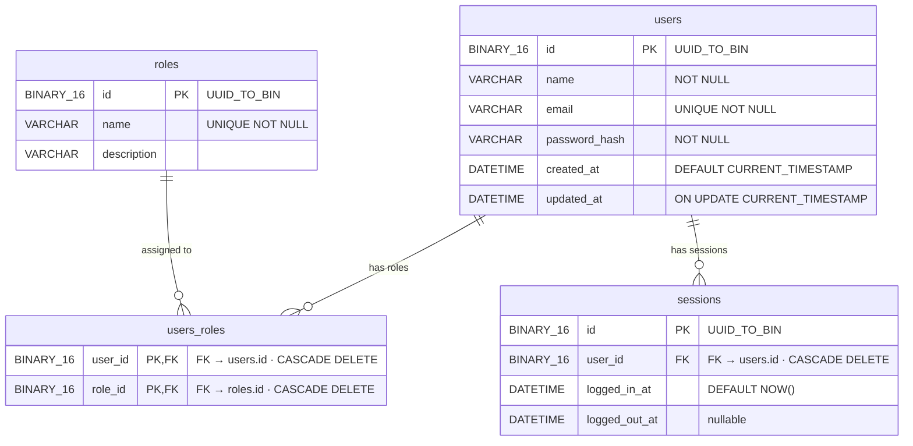

# UMS — User Management Service

[← Back to root README](../README.md)

The **User Management Service (UMS)** is the identity backbone of the Bird platform. It owns all user accounts, role assignments, and session records. Every other service trusts UMS as the single source of truth for authentication and authorization.

---

## Responsibilities

- CRUD operations on user accounts
- Role catalogue management (`ADMIN`, `PRODUCER`, `SUBSCRIBER`)
- Many-to-many user ↔ role assignment
- Session lifecycle (open / close / query)

---

## Tech Stack

| Concern | Technology |
|---|---|
| Runtime | Java 25 (preview features enabled) |
| Framework | Spring Boot 4.0.5 — WebFlux (reactive, Netty) |
| Persistence | Spring JDBC (`JdbcTemplate`) |
| Database | MySQL 8 — `ums` schema |
| JSON | Jackson + `JavaTimeModule` (ISO-8601 dates) |
| Build | Gradle 9.4.1 |
| Boilerplate | Lombok (`@Data`, `@AllArgsConstructor`, etc.) |

---

## Database Schema



> **Why `BINARY(16)`?** UUIDs stored as `CHAR(36)` waste space and slow index operations. `BINARY(16)` stores the raw 16 bytes — half the size — and uses `UUID_TO_BIN()` / `BIN_TO_UUID()` in every SQL statement to convert transparently.

---

## API Endpoints

Base URL: `http://localhost:9000`

All responses use a standard JSON envelope:
```json
{
  "code": "200",
  "message": "Human-readable status",
  "data": { ... }
}
```

### Users

| Method | Path | Description |
|---|---|---|
| `GET` | `/users` | List all users (with roles) |
| `POST` | `/users/user` | Create a new user |
| `GET` | `/users/user/{id}` | Get user by UUID |
| `PUT` | `/users/user/{id}` | Update user (name, email, password) |
| `DELETE` | `/users/user/{id}` | Delete user |
| `POST` | `/users/user/{id}/role/{roleId}` | Assign a role to a user |

### Roles

| Method | Path | Description |
|---|---|---|
| `GET` | `/roles` | List all roles |

### Sessions

| Method | Path | Description |
|---|---|---|
| `POST` | `/sessions/user/{userId}` | Open a new session → returns session UUID |
| `GET` | `/sessions/user/{userId}/last` | Get the user's most recent session |
| `PUT` | `/sessions/{sessionId}/close` | Close a session (sets `logged_out_at`) |

---

## Package Structure

```
com.ziminpro.ums/
├── UmsApplication.java
├── config/
│   └── CorsConfig.java              ← CORS headers for browser clients
├── controllers/
│   ├── UserController.java          ← /users endpoints
│   ├── RolesController.java         ← /roles endpoints
│   └── SessionController.java       ← /sessions endpoints
├── dao/
│   ├── UmsRepository.java           ← Interface
│   ├── JdbcUmsRepository.java       ← JdbcTemplate implementation
│   └── DaoHelper.java               ← byte[] ↔ UUID conversion
└── dtos/
    ├── User.java                    ← User DTO (with List<Role>)
    ├── Roles.java                   ← Role enum / DTO
    ├── LastSession.java
    └── Constants.java               ← All SQL strings centralised here
```

---

## Configuration

`src/main/resources/application.yaml`:

```yaml
server:
  port: 9000

spring:
  datasource:
    driverClassName: com.mysql.cj.jdbc.Driver
    url: jdbc:mysql://0.0.0.0:3306/ums?serverTimezone=UTC&useLegacyDatetimeCode=false
    username: root
    password: passw
```

---

## Build & Run

```bash
cd $HOME/bird/ums

# Build (runs tests, compiles, packages JAR)
gradle build

# Run
java-jar build/libs/ums-2.0.jar
```
---

## Notable Implementation Details

**SQL centralised in `Constants.java`** — All SQL strings live as `public static final String` constants. This keeps DAO classes clean and SQL changes easy to locate without an ORM.

**Multi-role result collapsing** — `GET /users` joins `users → users_roles → roles`, producing one row per role per user. The DAO collapses these into a single `User` object with a `List<Role>` using a custom `ResultSetExtractor`.

**`ON UPDATE CURRENT_TIMESTAMP`** — The `users.updated_at` column updates automatically on every `UPDATE` at the database level, requiring no application-side logic.

**Session history** — Rather than a simple "last login" column, a `sessions` table records every login and logout, enabling full audit capability and concurrent session detection.

---

[← Back to root README](../README.md) | [Twitter Service →](../twitter/README.md) | [Frontend →](../frontend/README.md)